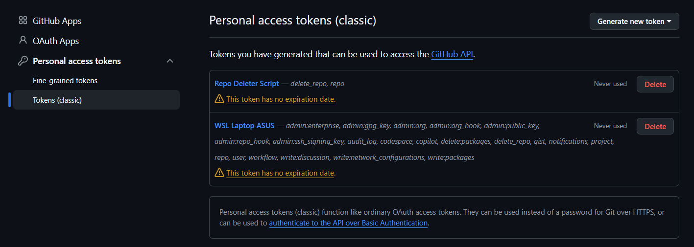
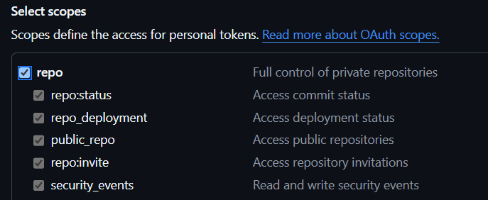

# GitHub Batch Repo Deleter

> A fast, zero-dependency Python CLI tool to batch delete GitHub repositories (public & private) effortlessly.

[](https://github.com/JackBerck/recycle-git/actions)
[](https://www.python.org/)
[](LICENSE)
[]()

## 🌟 Features

- ⚡ **Zero External Dependencies** — Built entirely with Python standard library (`urllib`). No `pip install` required.
- 🔒 **Private & Public Support** — Automatically scans all repositories you own.
- 🎯 **Flexible Selection** — Select repos by index numbers (`1, 3, 5`), ranges (`2-5`), name keywords (`repo-name`), or `all`.
- 🔄 **Interactive & Clean UI** — Auto-clears terminal screen and supports continuous loop deletion sessions.
- 🛡️ **Safety Confirmation** — Explicit confirmation prompt (`DELETE`) prevents accidental deletions.

---

## 📋 Prerequisites

Before running the tool, ensure you have:

1. **Python 3.6 or higher** installed on your system (`python --version`).
2. A **GitHub Personal Access Token (PAT Classic)** with required permissions.

---

## 🔑 GitHub Token Setup

1. Go to **GitHub Settings** ➔ **Developer Settings** ➔ **Personal Access Tokens** ➔ **Tokens (classic)**.
2. Click **Generate new token (classic)**.



3. Set a **Note** (e.g., `Repo Deleter`) and choose an **Expiration** date.
4. Select the following required scopes:
   - ✅ `delete_repo` *(Required to delete repositories)*
   - ✅ `repo` *(Required to scan private repositories)*



5. Click **Generate token** at the bottom and copy your generated token string (`ghp_...`).

---

## 🚀 Quick Start

### 1. Clone the repository
```bash
git clone https://github.com/JackBerck/recycle-git.git
cd recycle-git
```

### 2. Configure Environment Variable
Copy `.env.example` to `.env`:
```bash
cp .env.example .env
```

Open `.env` and paste your GitHub token:
```env
GITHUB_TOKEN=ghp_your_github_token_here
```

*(Alternatively, if `.env` is omitted, the script securely prompts for your token at runtime).*

### 3. Run the Script
```bash
python delete_repos.py
```

---

## 💡 Usage & Selection Syntax

When prompted, you can select repositories using flexible input formats:

- **Single or Multiple Indices:** `1` or `1, 3, 5` or `1 3 5`
- **Index Range:** `2-5`
- **Repository Name / Substring:** `my-repo-name`
- **All Repositories:** `all` or `*`

After entering your selection, type `DELETE` when prompted to execute deletion.

---

## ⚠️ Security Notice

> [!CAUTION]
> Repository deletion via GitHub REST API is **PERMANENT and CANNOT BE UNDONE**. Always review selected repositories before typing `DELETE`.

---

## 📄 License

This project is licensed under the [MIT License](LICENSE).
